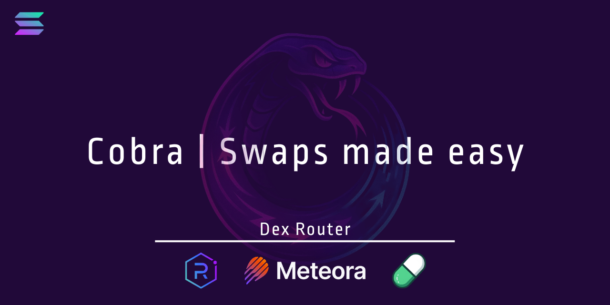

## Cobra: Buy, sell, search pools, and more on all Raydium, Pump.fun, and Meteora AMMs.

**Overview:**
[**Cobra**](https://github.com/FLOCK4H/Cobra) is a personal **off-chain DeX router for Solana** 

Installing it allows you to grind custom vanity keys, find markets for mints, locate pools with sufficient liquidity, and perform swaps across various supported markets - all using either a built-in CLI application, or via code. Imagine a swiss kinfe for DeFi on Solana. Cobra is designed to be a versatile tool for traders and developers alike. 

!!! note
    Cobra is not a wallet, it does not hold your funds. It is a tool to interact with DeFi protocols on Solana. Whole project runs directly on your machine, the speed of routing, sending transactions, and other interfaces depends only on your RPC Node, and/or your machine.
 

## Supported Markets

1. [Raydium CLMM](https://github.com/FLOCK4H/Cobra/tree/main/CobraRouter/CobraRouter/router/raydiumswap/clmm)
2. [Meteora DLMM](https://github.com/FLOCK4H/Cobra/tree/main/CobraRouter/CobraRouter/router/meteora_dlmm)
3. [PumpFun](https://github.com/FLOCK4H/Cobra/tree/main/CobraRouter/CobraRouter/router/pump_fun)
4. [PumpSwapAMM](https://github.com/FLOCK4H/Cobra/tree/main/CobraRouter/CobraRouter/router/PumpSwapAMM)
5. [MeteoraDAMM v1](https://github.com/FLOCK4H/Cobra/tree/main/CobraRouter/CobraRouter/router/meteora_damm_v1)
6. [MeteoraDAMM v2](https://github.com/FLOCK4H/Cobra/tree/main/CobraRouter/CobraRouter/router/meteora_damm_v2)
7. [Meteora Dynamic Bonding Curve](https://github.com/FLOCK4H/Cobra/tree/main/CobraRouter/CobraRouter/router/meteoraDBC)
8. [Raydium CPMM](https://github.com/FLOCK4H/Cobra/tree/main/CobraRouter/CobraRouter/router/raydiumswap/cpmm)
9. [Raydium AMM V4](https://github.com/FLOCK4H/Cobra/tree/main/CobraRouter/CobraRouter/router/raydiumswap/amm_v4)
10. [Raydium Launchlab](https://github.com/FLOCK4H/Cobra/tree/main/CobraRouter/CobraRouter/router/raydiumswap/launchlab)